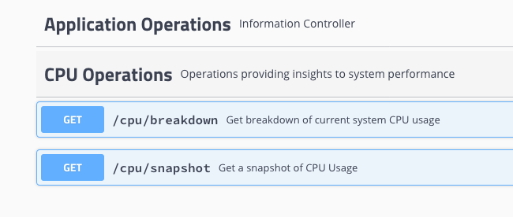

# CPU Usage Sample

This sample is a demonstration of how to rapidly stand up a REST API to expose functionality from within the z/OS mainframe normally only available via green screen. Using in this case SDSF functionality that is made available through ISFJCALL we can access SDSF functions such as current CPU usage.

This sample is not intended to be used in a production environment as-is but instead is intended to serve as a template for anyone else wanting to quickly get their own functionality running on Zowe via the API Gateway

## Prerequisites

In order to build the sample it's necessary to download the ISFJCALL jar file. When running on the z/OS machine the API's will interface with the libraries provided by the Java SDK which need to be enabled.  

For more information about SDSF and ensuring your installation is running the Java SDK please consult publication: SC27-9028-30: z/OS SDSF User's Guide

## Build

For this example it is necessary to download the isfjcall.jar file from the host server so that the build can compile against it. Locate the file in the uss folder /usr/lpp/sdsf/java/classes/ and download it to your local machine Run the following command to install it into your local maven repo 
```
mvn install:install-file -Dfile=<your_download_folder>/isfjcall.jar -DgroupId=com.ibm -DartifactId=isfjcall -Dversion=1.0 -Dpackaging=jar
```

Run the build...
```
mvn clean verify
```

## Deploy

The build creates a file called cpu-usage.pax that is to be transferred to your server. Create and change directory to zowe-extra. Copy this file here and extract using the command pax -ppx -rf cpu-usage.pax

## Update script variables

Update the PORT and ZOWE_LOCATION variables in run-cpu-usage.sh to reflect your installation. SDSF is normally in the same place but check and reset this variable if it is not.

Update the install.sh file using the same PORT and ZOWE_LOCATION variables from the run-cpu-usage.sh along with the ZOWE_EXPLORER_HOST name.

## Run Scripts

*Note* Run once only
The install.sh script creates the configuration necessary to define your service to the API Mediation layer. Run this script to create the definition although the Zowe server will need to be restarted to pick up this definition later.

The cpu-usage.sh starts the Spring Boot application itself and runs independently of zowe so running from a command line you should see something like this.. 

```
Started UsageInfoApplication in 7.338 seconds (JVM running for 8.709)
```

*Note* I would expect that in a production scenario this shell script would be replaced by a job or other more formalised process.

In a browser type the address https://{ZOWE_EXPLORER_HOST}:{PORT}/swagger-ui.html to see the following:



These entries can be expanded and the API's run confirming that your sample is installed locally. 

If not already done so when running the cpu-usage-mediation-configure.sh restart the zowe server. 
You will now be able to access the API's through the Gateway. Try the following:

```
https://{ZOWE_EXPLORER_HOST}:{ZOWE_PORT}/api/v1/cpu/snapshot
```

You will see a snapshot of CPU readings.

## What Next?

1. Use this project as a template to enable your own API's
2. Extend this sample with additional API's from SDSF
